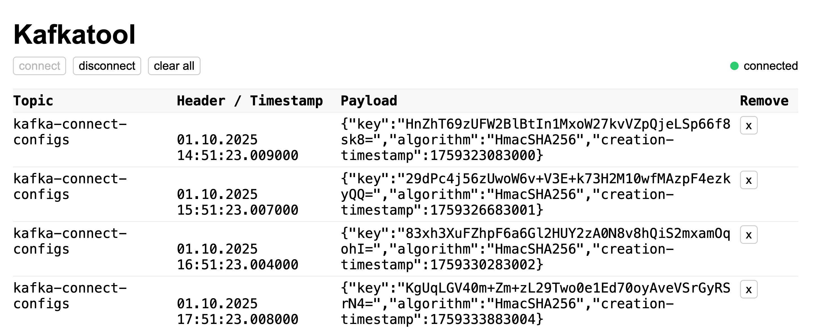

# Vibe coded kafka tool

Idea: Observe all messages on a local kafka broker while developing

- Reads all topics at once from local kafka
- Print the received messages in the browser

## How to use

- Configure ports in application.yml
- Start KafkatoolApplication
- Open http://localhost:8080

